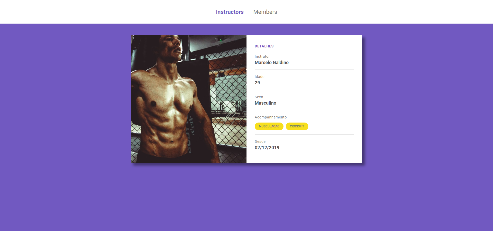
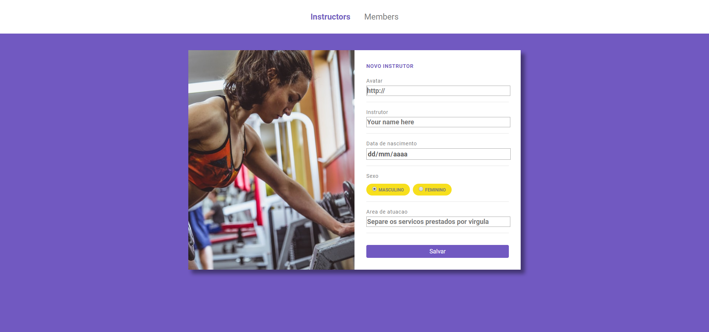

# Gym Manager

<p align="center">
    
    
</p>

<p align="center">
Manages your gym point easily with Gym Manager.

<br>
<br>


## STACK

- Javascript
- HTML
- CSS
- NodeJS

### Dependencies

<p>
Use npm as your default package manager

```
npm install
``` 
</p>

- Web
    -  
    -  


<br>

<blockquote alt="[ignore]">
<p>
This project comes from Rocketseat's launch base bootcamp, and it is only for study purposes. The brand, logo and name are non professional
</p>
</blockquote>